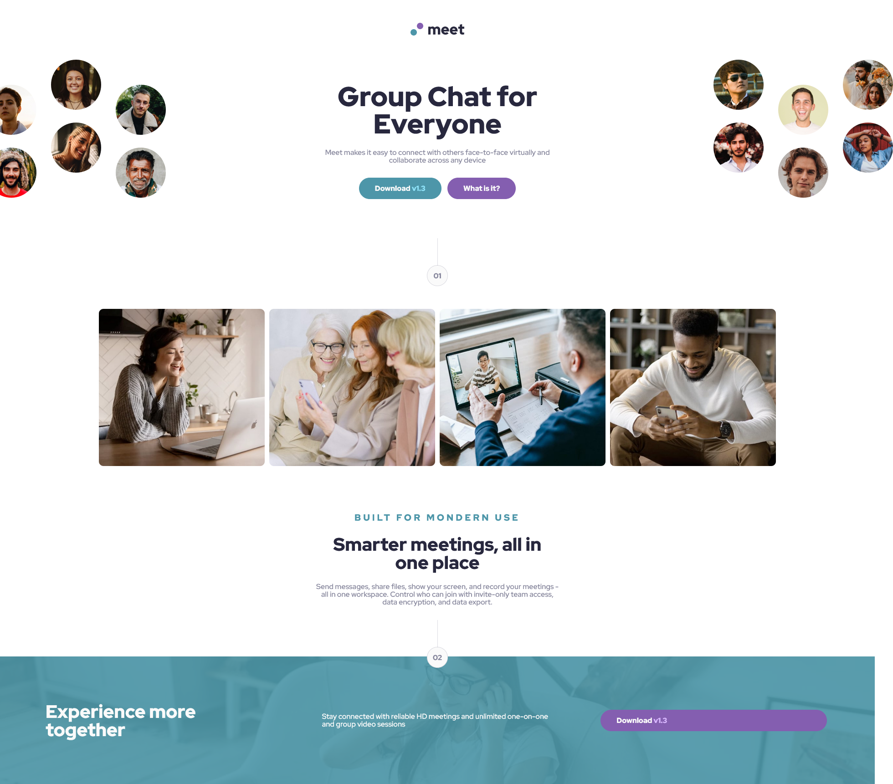

# Frontend Mentor - Meet landing page solution

This is a solution to the [Meet landing page challenge on Frontend Mentor](https://www.frontendmentor.io/challenges/meet-landing-page-rbTDS6OUR). Frontend Mentor challenges help you improve your coding skills by building realistic projects.

## Table of contents

- [Overview](#overview)
  - [The challenge](#the-challenge)
  - [Screenshot](#screenshot)
  - [Links](#links)
- [My process](#my-process)
  - [Built with](#built-with)
  - [What I learned](#what-i-learned)
  - [Continued development](#continued-development)
  - [Useful resources](#useful-resources)
- [Author](#author)
- [Acknowledgments](#acknowledgments)

## Overview

### The challenge

Users should be able to:

- View the optimal layout depending on their device's screen size
- See hover states for interactive elements

### Screenshot

### Links

- [Frontend Solution](https://www.frontendmentor.io/solutions/meeting-landing-page-cv5cRQgHdH)
- [Live Site](https://callietron300.github.io/meet-landing-page/)

## My process

### Built with

- Semantic HTML5 markup
- CSS custom properties
- Flexbox
- SCSS

### What I learned

- I used the figma file for font sizes however I found it hasnt helped make a replica deisgn. I think i've had more sucess in guessing rems by eye.

Things I would love help with:

- I struggled adding margins for my hero-text element- I created a margin class to add the margin in
- I cant stop the page from showing the overflow on the right from the offset pictures at the top
- my btn is taking up the full width of the column and I cant workout how to fix this- its only an issue in desktop view

### Continued development

### Useful resources

## Author

Callie :)

## Acknowledgments

# meet-landing-page
